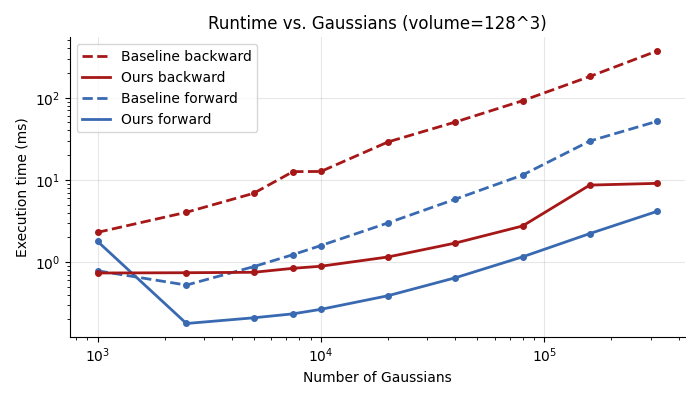
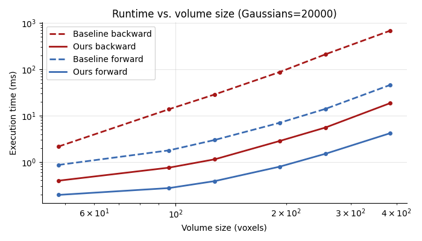

# Fast Gaussian Splatting Voxelizer

Fast implementation of the Gaussian Splatting Voxelizer. Implemented as a part of the paper:
> FaCT-GS: Fast and Scalable CT Reconstruction with Gaussian Splatting

### [Main Repository](https://github.com/PaPieta/fact-gs) | [Paper](TBA) | [Project Page](TBA)


#### Related repositiories (applied in the paper):
[Fast CT Rasterizer](https://github.com/PaPieta/gs-ct-rasterizer) | [Fused SSIM](https://github.com/rahul-goel/fused-ssim) (2D and 3D) | [Fused 3D TV](https://github.com/PaPieta/fused-3D-tv)

## Prerequirements

1. You must have PyTorch installed with CUDA backend, and an NVIDIA GPU
2. This repo requires [GLM](https://github.com/g-truc/glm). It will be downloaded automatically to ```gs_voxelizer/third_party/glm```. To provide the library from another location, set the "GLM_HOME" env variable to an appropriate path (```export GLM_HOME=my/path/to/glm/lib```).

Check ```test/test_requirements.txt``` for additional python requirements needed to run the test scripts.

> If you plan to run the whole FaCT-GS reconstruction pipeline, it is recommended to follow the installation steps from the [Main Repository](https://github.com/PaPieta/fact-gs).

## Installation

In the cloned repository:
```
pip install . --no-build-isolation
```

## Minimal example

>Using test/utils.py

```python
from gs_voxelizer import voxelize, optim_to_render
import utils
import torch
from torch.nn.functional import l1_loss

vol_size_voxel = (100, 150, 80)  # (z, y, x)
# Below are needed for compatibility with CT rasterizer in reconstruction tasks
# If voxelizer is used separately, they can be largely ignored.
# Keep them in the below "default" setup if gaussians are initialized in 0-1 position range
vol_size_world = (1.0, 1.0, 1.0) # (z, y, x)
vol_center_pos = (0.5, 0.5, 0.5) # (z, y, x)

num_gaussians = 5000
# Init test volume (z, y, x)
vol = utils.generate_test_volume(vol_size_voxel)
utils.save_slices_as_images(vol, "test_out/generated_vol")
# Initialize gaussians within the volume
pos3d, scale3d, quat, intensity = utils.random_gauss_init(num_gaussians, vol)
# Enable gradients
pos3d = pos3d.requires_grad_()
scale3d = scale3d.requires_grad_()
quat = quat.requires_grad_()
intensity = intensity.requires_grad_()
# Convert to rendering parameters (includes tile coverage stats)
pos3d_viz_radii, conics, tile_min, tile_max, num_tiles_hit = optim_to_render.optim_to_render(
    pos3d,
    scale3d,
    quat,
    intensity,
    vol_size_voxel,
    vol_size_world,
    vol_center_pos,
)
# pos3d_viz_radii stores xyz positions in voxel units and minimum enclosing radii in w for 16-byte alignment.
# Voxelize gaussians over the (z, y, x) grid
voxelized_vol = voxelize.voxelize_gaussians(
        pos3d_viz_radii,
        conics,
        intensity,
        vol_size_voxel,
        tile_min,
        tile_max,
        num_tiles_hit,
    )
# Calculate loss (e.g., L1)
voxelized_vol = voxelized_vol.squeeze().unsqueeze(0).unsqueeze(0)
target_volume = torch.from_numpy(vol).unsqueeze(0).unsqueeze(0).to(voxelized_vol.device)
loss = l1_loss(voxelized_vol, target_volume)
# Backward pass
loss.backward()
```

### Note!

Voxelizer supports volumes with up to 4 channels. The paper and performance tests only cover running it in the 1-channel version.

## Performance Comparison

Baseline is sourced from [r2_gaussian](https://github.com/Ruyi-Zha/r2_gaussian/tree/main/r2_gaussian/submodules/xray-gaussian-rasterization-voxelization).

  

## Acknowledgements

Codebase adapted from [image-gs](https://github.com/NYU-ICL/image-gs). Implementations inspired by [r2_gaussian](https://github.com/Ruyi-Zha/r2_gaussian/tree/main/r2_gaussian/submodules/xray-gaussian-rasterization-voxelization), [taming-3dgs](https://github.com/humansensinglab/taming-3dgs), [StopThePop](https://github.com/r4dl/StopThePop).

## LICENSE

MIT License (see LICENSE file).